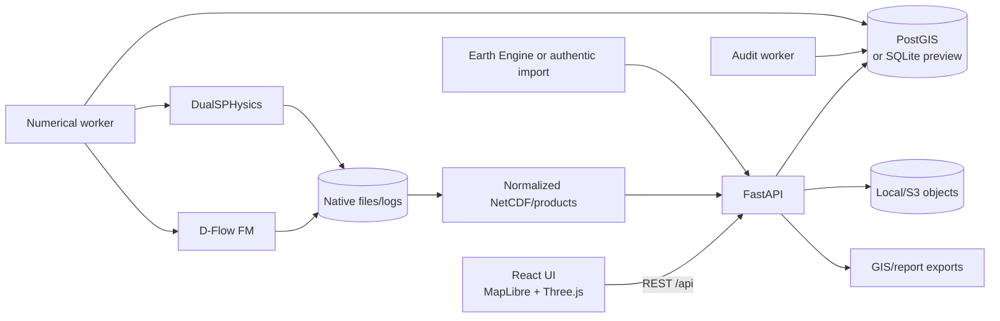
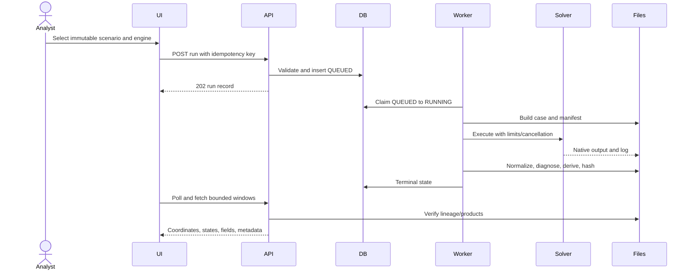
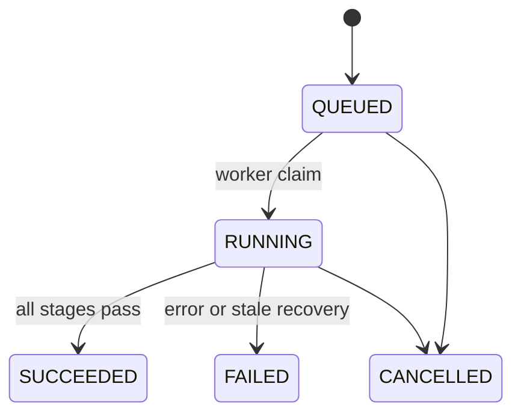

# DamSafe System Architecture

## Components

The browser orchestrates APIs and visualizes saved values; it never calculates hydraulic results. FastAPI validates contracts, enforces project identity, resolves lineage and exposes bounded reads. SQL stores metadata/lifecycle. Object storage holds immutable uploads. Run storage holds generated cases, native files, NetCDF, products, logs and exports. Separate workers claim audit and numerical queues.

## Simulation sequence

## Ingestion and scenarios

Uploads include a `DatasetInput` contract and binary body. The API checks filename/type/project synthetic status/size/metadata/content, hashes and stores `{project_id}/{dataset_id}.{ext}`, then inserts an immutable version. A correction creates a new version.

Historical release workflow: qualify time series → identify measurement/station/timezone/flags → bind hydrograph and observed boundaries → freeze snapshot → run regional model → assess only matching times/grids.

Hypothetical breach workflow: record reservoir/storage, dam component, method and parameters with sources/assumptions → freeze a `computed_breach` scenario → generate breach forcing when integrated → use D-Flow FM regionally and DualSPHysics only for separately defined near-field scope. Contract/library exist; full API/UI-to-run integration is PARTIAL.

## Lifecycle and failure

Retry uses a new identity unless an identical cached result is returned. Errors are bounded. Restart recovery fails stale `RUNNING` rows rather than claiming success.

## Results and visualization boundary

Native engine files remain evidence. Adapters normalize 2D fields; product derivation writes maxima, arrival, duration, states and area. APIs bound bbox/frame reads. Exports use verified normalized/product files. MapLibre projects geographic cell centres; Three.js renders saved particles.

Centre points are not mesh polygons and the UI must not invent a continuous flood surface. Regional “3D” is a browser view of saved 2D values, not a 3D solver. Cesium terrain is PLANNED. DualSPHysics is genuine saved solver output but only laboratory/near-field evidence.

Earth Engine discovery/import supplies provenance. SAR assessment additionally needs compatible pre/event scenes, orbit, processing/masks, time, coverage, CRS/grid and valid mask. Those components exist, but a qualified Ujjani historical assessment is BLOCKED.

## Security and deployment

Compose binds API to loopback, keeps DB internal except optional loopback numerical access, and exposes no Docker socket to API. There is no endpoint authentication, so current architecture is local/trusted-workstation only.

| Concern | Current | Planned |
|---|---|---|
| Database | PostGIS Compose; SQLite preview | managed backed-up PostGIS |
| Compute | local Docker numerical worker | authenticated worker pool after profiling |
| 2D map | native face polygons where available | scalable tiles and richer inspection |
| Regional 3D | Three.js view | Cesium terrain with source attribution |
| Satellite | components; live execution unverified | qualified scheduled/event assessment |
| Security | loopback/same-origin/trusted-host | identity, project auth, TLS, rate limits, audit |
