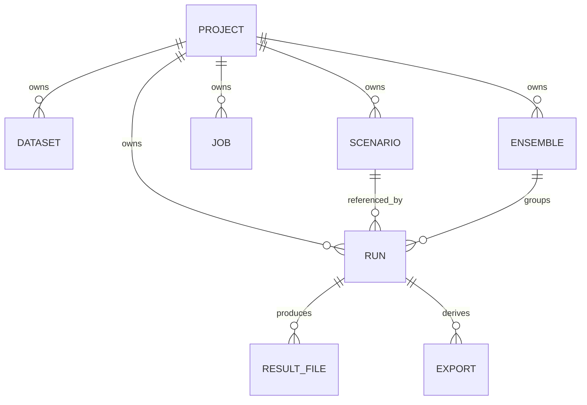

# Backend and API Contract

## Backend map

| Path | Responsibility |
|---|---|
| `api.py` | FastAPI lifecycle, guards and routes |
| `contracts.py` | frozen strict Pydantic inputs and enums |
| `db.py`, `migrations/` | tables, connections, immutable triggers |
| `ingestion.py`, `readiness.py` | source inspection and project readiness |
| `storage.py` | local/S3 object abstraction and safe keys |
| `worker.py` | readiness audit queue |
| `numerics/adapters.py` | pinned engine capabilities/execution adapters |
| `numerics/service.py`, `worker.py` | run submit, identity, claim, recovery, cancellation |
| `numerics/results.py`, `products.py` | normalize/query NetCDF and derive products |
| `numerics/comparison.py` | compatible-run comparison |
| `numerics/sph.py`, `sph_adapter.py` | particle parsing and browser payloads |
| `exports.py` | GeoTIFF/SHP/KML/GeoJSON/CSV/HTML |
| `observation/` | Earth Engine/import, SAR classification, comparison, gauges, exposure |
| `site/` | Ujjani reference, terrain sampling, case/breach builders and readiness |

## Entities



| Table/entity | Important fields and constraints |
|---|---|
| `projects` | `id` string PK; `body` JSON `ProjectInput`; bounds require source URL |
| `datasets` | `id` PK; `project_id` FK; `name`; integer `version`; JSON body with storage key, bytes, SHA-256, inspection; immutable update/delete trigger; version allocated per project/name |
| `scenarios` | `id` PK; `project_id` FK; JSON body with immutable snapshot, SHA-256, created time, evidence status; immutable update/delete trigger |
| `jobs` | `id` PK; project FK; state; JSON body; mutable worker result/state |
| `runs` | `id` PK; project FK; `idempotency_key`; state; immutable `input`; mutable `result`; unique project/idempotency key |
| `ensembles` | `id` PK; project FK; JSON body; submitted variant/run IDs |
| Results/exports/audits | File-backed and referenced from run/dataset JSON; no separate SQL tables currently |

Scenario snapshots copy the project, selected dataset records and exact scenario contract, then hash canonical JSON. Later dataset versions cannot change that snapshot. `RunState`: `QUEUED`, `RUNNING`, `SUCCEEDED`, `FAILED`, `CANCELLED`. `execution_origin`: `LOCAL` or `IMPORTED`. `InputMode`: `OBSERVED`, `MIXED_ASSUMPTIONS`, `SYNTHETIC`. `EvidenceStatus`: `UNASSESSED`, `BENCHMARK_CHECKED`, `HISTORICAL_EVENT_ASSESSED`.

## Authentication and common errors

All implemented routes are **unauthenticated**. The server is intended for loopback use. Common responses: `200/201/202` success; `404` missing or wrong-project record; `409` terminal cancellation, incompatible/missing derived evidence, or conflict; `413` upload too large; `415` unsupported upload; `422` validation, scientific-contract, bounds or query error; `500` unexpected failure. Pydantic schemas reject unknown fields and non-finite values.

## Implemented endpoints

Schema names refer to `contracts.py` or response producers. Lists are JSON arrays unless stated.

| Method and route | Purpose | Request | Response | Specific errors |
|---|---|---|---|---|
| `GET /api/health` | DB/PostGIS/engine readiness | none | status, database, preview, engines | DB failure 500 |
| `GET /api/projects` | list projects | none | `Project[]` | — |
| `GET /api/projects/{project_id}` | project detail | path ID | `Project` | 404 |
| `POST /api/projects` | create project | `ProjectInput` | 201 `Project` | 422 CRS/bounds/source |
| `GET /api/projects/{project_id}/datasets` | list versions | project ID | `Dataset[]` | 404 |
| `POST /api/projects/{project_id}/datasets` | stream/inspect/version source | query `filename`, `metadata_json: DatasetInput`; binary body | 201 dataset record | 413, 415, 422, 404 |
| `GET /api/projects/{project_id}/scenarios` | list snapshots | project ID | `Scenario[]` | 404 |
| `POST /api/projects/{project_id}/scenarios` | create immutable snapshot | `ScenarioInput` | 201 scenario record | 404, 422 dataset/hydrograph identity |
| `GET /api/projects/{project_id}/scenarios/{scenario_id}` | snapshot detail | IDs | scenario record | 404 |
| `GET /api/projects/{project_id}/readiness` | assess project/snapshot | optional `scenario_id` | missing/warnings report | 404 |
| `POST /api/projects/{project_id}/readiness-jobs` | queue audit | none | 202 job ID/state | 404 |
| `GET /api/projects/{project_id}/jobs` | list audits | project ID | raw job records | 404 |
| `POST /api/projects/{project_id}/jobs/{job_id}/cancel` | cancel active audit | IDs | ID/CANCELLED | 404, 409 |
| `POST /api/projects/{project_id}/runs` | submit numerical run | `RunRequest` | 202 run record | 404, 409/422 readiness/identity |
| `GET /api/projects/{project_id}/runs` | list runs | project ID | run records | 404 |
| `GET /api/projects/{project_id}/runs/{run_id}` | run detail | IDs | run record | 404 |
| `POST /api/projects/{project_id}/runs/{run_id}/cancel` | cancel active run | IDs | run cancellation | 404, 409 |
| `GET .../results/metadata` | normalized result metadata/lineage | IDs | `ResultMetadata` | 404, 409 |
| `GET .../results/window` | bounded field frames | `bbox`, `field`, `first_frame`, `frame_count` | cells and frame values/states | 404, 422 |
| `GET .../results/series` | cell time series | `cell`, frame range | point series | 404, 422 |
| `GET .../products/window` | derived product cells | `bbox`, `field` | product values/states | 404, 409, 422 |
| `GET .../products/area` | flooded/unknown area series | frame range ≤32 | threshold/semantics/frames | 404, 409, 422 |
| `GET .../products/location` | nearest-cell series | `name,x,y,radius_m`, frame range | location/arrival/series | 404, 409, 422 |
| `GET .../compare/{other_run_id}` | compare compatible runs | two run IDs | compatibility and metrics | 404, 409/422 incompatible |
| `POST /api/projects/{project_id}/ensembles` | submit 1–8 run variants | `EnsembleInput` | 202 ensemble | underlying run errors |
| `GET /api/projects/{project_id}/ensembles` | list ensembles | ID | records | 404 |
| `GET /api/projects/{project_id}/ensembles/{ensemble_id}` | ensemble detail | IDs | record | 404 |
| `GET .../ensembles/{ensemble_id}/summary` | summarize terminal compatible variants | IDs | scenario-frequency summary | 404, 409 |
| `POST .../exports/{export_format}` | create/download export | format path | file response | 404, 409, 422 unsupported |
| `GET .../exports/{export_format}/verify` | reopen/verify export | format path | verification JSON | 404/409/422 |
| `POST /api/observation/gee/query` | scene discovery/readiness | `site_key`, `mode`, optional target time | `SatelliteObservation` | state generally encoded in response |
| `POST /api/observation/import` | register authentic external observation | `ImportedObservationInput` | `SatelliteObservation` | 422 path/metadata/integrity |
| `POST .../compare_satellite` | compare run with observation | `mode`, optional target time | `SatelliteComparisonResult` | 404, 409/422; may return insufficient status |
| `GET .../gauges/{station_id}` | gauge evidence check | IDs | `GaugeAssessmentResult` | 404 run; insufficiency encoded |
| `GET .../exposure` | exposure response | IDs | `ExposureAssessmentResult` | 404; current fixed values are non-scientific demo content |
| `GET /api/sph/runs` | discover retained particle runs | none | `{runs: string[]}` | — |
| `GET /api/runs/{run_id}/sph/metadata` | SPH metadata | run ID | metadata/variables/bounds | 404 |
| `GET /api/projects/{project_id}/runs/{run_id}/sph/metadata` | alias; checks project run only if project route used | IDs | same | 404 |
| `GET /api/runs/{run_id}/sph/frame` | saved particle frame | `index`, `decimation` 1–16 | positions/velocity/density/derived pressure | 404, 422 |
| `GET /api/projects/{project_id}/runs/{run_id}/sph/frame` | project alias | IDs/query | same | 404, 422 |
| `GET /` | built SPA or API status fallback | none | HTML or JSON | — |

## Core request examples

```json
{
  "name": "Example bounded reach",
  "site_key": "example-reach",
  "synthetic": true,
  "description": "Fictional test project",
  "verified_bounds_wgs84": null,
  "computation_crs": "EPSG:32643",
  "vertical_reference": null,
  "source_url": null
}
```

```json
{
  "engine": "dflowfm",
  "case_kind": "OFFICIAL_EXAMPLE",
  "scenario_id": null,
  "idempotency_key": "example_run_001",
  "particle_spacing_m": null
}
```

```json
{"id":"fictional-id","state":"QUEUED","input":{"request":{"engine":"dflowfm","case_kind":"OFFICIAL_EXAMPLE"}},"result":{}}
```

## Validation, worker and storage rules

Hydrology needs column/station/measurement mapping. Scenario end follows start; positive time steps/thresholds; output interval is not shorter than step; arrival threshold is at least wet threshold; dataset IDs are unique and project-owned. Synthetic datasets cannot enter a non-synthetic project. Terrain/vector content and CRS are inspected.

The numerical worker atomically claims a queued run, executes the appropriate adapter, reports progress, detects cancellation, normalizes and derives output, then updates terminal state. Stale running jobs are recovered as failures. Object key convention is `{project_id}/{dataset_id}.{extension}`; working runs are `{DAMSAFE_RUN_ROOT}/{run_id}/`; outputs/exports remain below that run directory. Exact subpaths depend on the adapter and retained manifest.

## Migrations

Set `DAMSAFE_DATABASE_URL`, then run:

```powershell
.\.venv\Scripts\python.exe -m alembic upgrade head
```

Revisions `0001`–`0003` create foundation tables/immutable triggers, numerical runs, and ensembles. Destructive downgrades intentionally raise; restore a backup instead.

## Planned endpoints

No planned route is part of the current API. Needed future contracts include authenticated users/project memberships, mesh-face geometry/tiles, breach-routing preview/submission, qualified exposure-layer overlay, and operational health/metrics. They must remain documented as PLANNED until implemented and tested.
